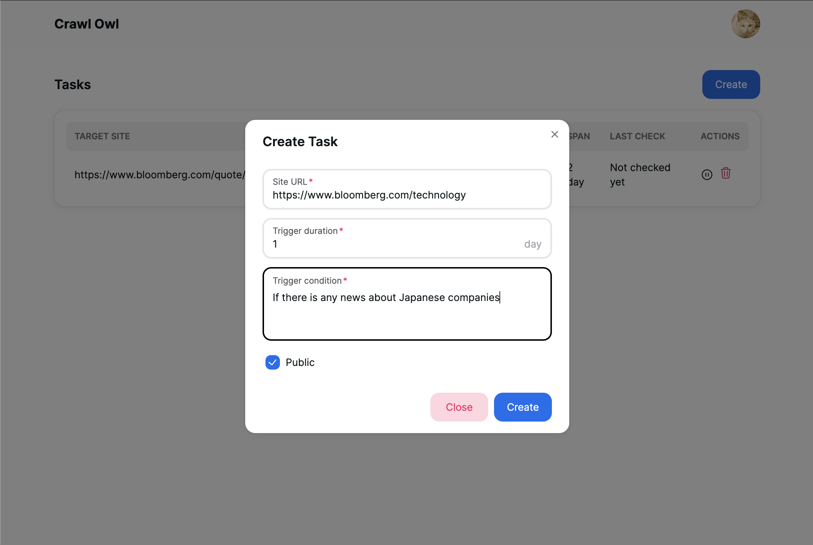

This is a backend repository for the project ["crawl-owl"](https://crawl-owl.vercel.app/). This project enables users to get notified when websites match the conditions they set. Users can set flexible and complicated conditions by natural language.

Check out the frontend repository [here](https://github.com/cheeseNA/crawl-owl-next) and crawler repository [here](https://github.com/cheeseNA/crawl-owl-scrape-functions).



### Directory structure

```
api/                  # OpenAPI specification
build/                # Build scripts (e.g. Dockerfile, docker-compose.yml)
cmd/main.go           # Main applications
internal/             # Internal packages
internal/funccall/    # Service for calling crawler functions
internal/middleware/  # Middleware for authentication
internal/ogen/        # ogen-generated code
internal/pkg/         # Internal packages
internal/repository/  # Model definitions and repositories
internal/service/     # Main service
scripts/              # Scripts for migration etc.
```

### How to run

Before running the project, you need to run the crawler.
You also have to set up firebase and [Resend](https://resend.com/), and set the environment variables under `build/` directory.

```bash
$ make install-modules
$ make run
```

### How to deploy

Run the built docker image on your server.
This project uses Cloud Run.
